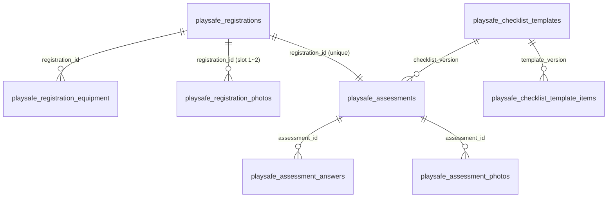

# PlaySafe 입력 필드 → DB 저장 스키마

대상 화면

- 시설정보 입력: `/assessment/facility` (`FacilityRegistrationSection`)
- 안전성평가: `/assessment` (`ChecklistSection` → `AssessmentGate` → `ChecklistApp`)

근거 파일

- 테이블: `supabase/migrations/20261005114226_playsafe_tables.sql`
- 저장 RPC: `supabase/migrations/20261005114237_playsafe_private_core.sql`, `20261005114246_playsafe_private_actions.sql`
- 권한(RLS): `supabase/migrations/20261005114259_playsafe_rls.sql`
- 사진 버킷: `supabase/migrations/20261005114302_playsafe_storage.sql`
- 입력자 키·무인증 전환: `supabase/migrations/20261005144200_playsafe_submitter_identity.sql`
- 단일 최종 등록: `supabase/migrations/20261005155621_playsafe_single_submission.sql`
- 시설 전경사진(최대 2장): `supabase/migrations/20261005231414_playsafe_facility_photos.sql`, 종결 포함 `20261005233258_playsafe_close_facility_photos.sql`
- API: `src/app/api/playsafe/**`

모든 테이블은 `public` 스키마이며 RLS가 켜져 있습니다. 회원가입·로그인·이메일 인증은 없습니다. 사용자는 **입력자 이름 + 입력자 이메일**을 입력하고, 브라우저는 이를 요청 헤더(`x-playsafe-submitter-name`, `x-playsafe-submitter-email`)로 보냅니다. 서버 라우트는 service_role로 RPC를 호출합니다. `authenticated` 역할에는 관리자 열람(SELECT)만 남아 있습니다.

**저장 시점**: 두 번 저장됩니다.

1. 2단계 **선택 확인 · 기구정보 등록** 버튼: 시설정보·등록신청(자격 답변)·시설 전경사진을 `save_playsafe_application`으로 저장합니다. 모두 `네`면 `registered`(기구·안전성평가 전), 하나라도 `아니요`면 `not_target`(대상 아님 종결)입니다.
2. 안전성평가 화면의 **안전성평가 완료 후 등록** 버튼: 시설정보·기구·평가·사진을 `submit_playsafe_registration`으로 한 번에 등록하고 상태를 `submitted`로 바꿉니다.

기구정보와 안전성평가는 작성 중에 브라우저(localStorage + IndexedDB `playsafe-photos`)에만 임시 저장됩니다.

**등록 고유 키**: `(submitter_email, submitter_name, facility_name)` unique. 같은 입력자는 시설명을 달리해 여러 시설을 등록할 수 있습니다. 이메일은 소문자·공백 제거, 이름은 앞뒤 공백을 제거해 저장합니다.

---

## 1. 전체 구조

| 화면 | 저장 테이블 | 저장 경로 |
| --- | --- | --- |
| `/assessment/facility` 시설·관리주체 정보, 자격 문항 | `playsafe_registrations` | 최종 등록 RPC `submit_playsafe_registration` |
| `/assessment/facility` 시설 전경사진(최대 2장) | `playsafe_registration_photos` + Storage `playsafe-facility-photos` | 최종 등록 시 서명 URL로 업로드(원본 + 썸네일) |
| `/assessment/facility` 기구정보 | `playsafe_registration_equipment` | 같은 RPC |
| `/assessment/facility` 기구사진 | Storage `playsafe-equipment-photos` + `equipment.photo_path` | 최종 등록 시 서명 URL로 업로드 |
| `/assessment` 평가자·평가일 | `playsafe_assessments` | 같은 RPC |
| `/assessment` 18개 항목 상태·메모 | `playsafe_assessment_answers` | 같은 RPC |
| `/assessment` 항목별 사진 | `playsafe_assessment_photos` + Storage `playsafe-checklist-photos` | 최종 등록 시 서명 URL로 업로드 |
| 2단계 선택 확인 (대상·대상 아님 모두) | `playsafe_registrations` (`registered` / `not_target`) + `playsafe_registration_photos` | 사진이 있으면 `POST /api/playsafe/applications/upload-urls`로 먼저 업로드 → `POST /api/playsafe/applications` → RPC `save_playsafe_application` |

최종 등록 순서 (`src/lib/playsafe-workflow/client/submitAssessment.ts`)

1. 브라우저가 등록 요청 id(`submissionId`, UUID)를 만들고 재시도 때도 같은 값을 씁니다.
2. `POST /api/playsafe/submissions/upload-urls`: 전체 입력을 검증한 뒤 사진별 서명 업로드 URL을 발급합니다. 저장 경로는 서버가 정합니다.
3. 브라우저가 사진을 하나씩 업로드합니다.
4. `POST /api/playsafe/submissions`: 파일이 모두 올라갔는지 확인(없으면 409)하고 RPC `submit_playsafe_registration`을 호출합니다. RPC가 실패하면 올린 파일을 지웁니다.
5. 성공하면 브라우저 임시 저장(시설정보·체크리스트·사진)을 비웁니다.

---

## 2. `/assessment/facility` — 시설정보 입력

2단계 **선택 확인 · 기구정보 등록**을 누르면 1·2단계 내용을 `save_playsafe_application`으로 DB에 저장합니다(2-2 참고). 대상이면 "시설정보와 등록신청정보가 DB에 저장되었습니다. 놀이기구 추가를 진행해 주세요." 안내 후 3단계로 이동하고, 대상 아님이면 대상 아님 팝업과 함께 기구정보 없이 종결됩니다. 3단계에서 **안전성평가 시작**을 누르면 기구정보를 포함한 입력값을 브라우저에 임시 저장하고 `/assessment`로 이동합니다. 같은 브라우저로 다시 들어오면 임시 저장된 시설정보를 불러옵니다.

### 2-1. Step 1 관리주체·시설정보 → `playsafe_registrations`

| 화면 라벨 | 입력 형식 | 요청 키 (`information.*`) | DB 컬럼 | 타입 / 기본값 | 제약·검증 |
| --- | --- | --- | --- | --- | --- |
| 정보 입력자 이름 (Step 1 제목 영역) | text, 필수, 최대 50자 | 헤더 `x-playsafe-submitter-name` (URI 인코딩) | `submitter_name` | `text not null` | 등록 키. 없으면 401 / `submitter_required`. 저장 후에는 화면에서 수정 불가 |
| 정보 입력자 이메일 (Step 1 제목 영역) | email, 필수 | 헤더 `x-playsafe-submitter-email` | `submitter_email` | `text not null` | 등록 키. 소문자로 저장, 형식 check 제약 |
| 시설명 | text, 필수 | `facilityName` | `facility_name` | `text not null` | 빈 값이면 `facility_name_required` |
| 임시시설번호 | 숫자만, 최대 5자 | `facilityNo` | `facility_no` | `text`, `''` | |
| 설치장소 | select | `place` | `place` | `text`, `''` | 선택지: 신종유사, 무인키즈카페, 무인키즈풀, 키즈펜션·풀빌라, 인증대상 기구가 아닌 놀이용 구조물, 놀이공간의 부가적 활용 구조물, 물놀이·현장 시공 설치물, 기타 |
| 기타 설치장소 | text (설치장소=기타일 때만) | `placeEtc` | `place_etc` | `text`, `''` | 기타가 아니면 `''`로 비움 |
| 우편번호 | 읽기 전용 (주소검색) | `postcode` | `postcode` | `text`, `''` | Daum 우편번호 서비스 결과 |
| 도로명 주소 | 읽기 전용 (주소검색) | `address` | `address` | `text`, `''` | |
| 상세주소 | text | `detailAddress` | `detail_address` | `text`, `''` | |
| 물놀이형 놀이기구 | select | `water` | `water` | `text`, `''` | `포함` / `미포함` |
| 실내외 구분 | select | `indoor` | `indoor` | `text`, `''` | `실내` / `실외` / `실내외` |
| 관리주체 성명 | text | `managerName` | `manager_name` | `text`, `''` | |
| 전화번호 | 숫자만, 최대 11자 | `phone` | `phone` | `text`, `''` | |
| 관리주체 이메일 | email, 선택 | `email` | `email` | `text not null`, `''` | 입력자 이메일과 별개인 연락처 |
| 개인정보 저장 동의 | checkbox, 필수 | `consentAt` (ISO 시각) | `consent_at` | `timestamptz not null` | 없으면 `consent_required` |

### 2-2. Step 2 신규설치 등록신청(자격 문항) → `playsafe_registrations`

5개 문항에 `네(yes)` / `아니요(no)`로 답합니다. **선택 확인 · 기구정보 등록**을 누르면 답과 관계없이 시설정보와 자격 답변을 저장합니다. 하나라도 `no`면 기구정보 등록이 종결되고 `submit_playsafe_registration`은 `not_eligible`로 거부합니다.

| 요청 키 | DB 컬럼 | 타입 / 기본값 | 저장 형태 |
| --- | --- | --- | --- |
| `answers` | `eligibility_answers` | `jsonb`, `'[]'` | `[{ "code": "...", "answer": "yes" }, ...]` |
| `eligibilityVersion` | `eligibility_version` | `text`, `'v1'` | 현재 `v1` |
| (서버 판정) | `all_eligible` | `boolean`, `false` | 모두 `yes`면 `true`, 아니면 `false` |

#### 등록신청 저장 (`POST /api/playsafe/applications` → RPC `save_playsafe_application`)

- 저장 대상: Step 1 시설·관리주체 정보 + 시설 전경사진 + Step 2 답변. `playsafe_registration_equipment`, `playsafe_assessments`, `playsafe_assessment_answers`는 만들지 않습니다.
- 모두 `yes`면 `status='registered'`, `all_eligible=true`. 하나라도 `no`면 `status='not_target'`, `all_eligible=false`.
- 입력자 이메일당 `registered`·`not_target` 등록은 최대 10건입니다(`too_many_pending_registrations`). 이미 안전성평가가 등록된(`submitted`) 시설은 다시 저장할 수 없습니다(`registration_has_assessment`).
- 같은 등록 키(또는 `id`)로 다시 저장하면 기존 행을 갱신하며, 답에 따라 `registered` ↔ `not_target`이 바뀝니다. 이후 안전성평가까지 최종 등록하면 같은 행이 `submitted`로 전환됩니다.
- 마이그레이션: `20261007044557_playsafe_save_application.sql` (이전 `close_playsafe_registration`은 구버전 호환용으로 DB에 남아 있으며 앱에서는 호출하지 않습니다)

문항 코드 (`src/data/playsafe/quiz.ts`)

| 순번 | `code` | 문항 |
| --- | --- | --- |
| 1 | `permanent-install` | 영구적으로 설치·고정되어 어린이 놀이가 가능한 설비 또는 기구가 있는가? |
| 2 | `not-registered-playground` | 어린이놀이시설로 등록되어 있지 않은가? |
| 3 | `gravity-or-body` | 중력 또는 어린이의 신체적 힘을 사용하여 놀 수 있는 설비나 기구인가? |
| 4 | `play-primary-use` | 어린이의 놀이 활동이 주된 용도인가? |
| 5 | `no-ppe-required` | 개인보호장비나 안전장비 없이 사용 가능한가? |

### 2-3. Step 3 기구정보 등록 → `playsafe_registration_equipment`

기구유형을 고르고 유형별로 수량·설치일자·메모·사진을 입력합니다. **등록수량 N은 DB에 별도 컬럼이 없고, 같은 내용의 행 N개로 펼쳐 저장됩니다.** 전체 기구는 1~5개여야 합니다(`equipment_count_invalid`). 최종 등록 시 해당 등록의 기구 행을 모두 새로 씁니다. 다른 등록과 기구 `id`가 겹치면 `equipment_id_conflict`입니다.

| 화면 라벨 | 요청 키 (`equipment[]`) | DB 컬럼 | 타입 / 기본값 | 비고 |
| --- | --- | --- | --- | --- |
| (클라이언트 생성) | `id` | `id` | `uuid` PK | `crypto.randomUUID()` |
| 기구유형 | `type` | `type_label` | `text not null` | 예: `오르는놀이형` |
| (유형에서 파생) | `typeCode` | `type_code` | `text not null`, FK → `playsafe_equipment_types.code` | 신종유사: `climb`, `cross`, `swing`, `slide`, `rock`, `water`, `etc`, `combo` / 별도관리: `unregistered`(미등록 놀이기구, 안전인증서 없는 제품) |
| 등록수량 | — | — | — | 행 개수로 표현, 미입력 시 1개 |
| 설치일자 | `date` | `installed_on` | `date`, null 허용 | 빈 값이면 `null` |
| 메모 | `memo` | `memo` | `text`, `''` | 화면에서 최대 500자 |
| 기구사진등록 | 별도 업로드 | `photo_path` | `text`, null 허용 | 2-4 참고 |
| (입력 순서) | — | `sort_order` | `integer`, `0` | 배열 순서(1부터) |
| (관리자 매칭) | — | `matched_equipment_id` | `bigint` → `playapi.equipment(id)` | 사용자 입력 아님 |

### 2-4. 기구사진 → Storage + `photo_path`

작성 중에는 IndexedDB(`playsafe-photos` › `equipment`)에 보관하고, 최종 등록 때 업로드합니다.

| 항목 | 값 |
| --- | --- |
| 버킷 | `playsafe-equipment-photos` (비공개) |
| 경로 | `{submissionId}/{equipmentId}.{jpg\|webp}` |
| 업로드 방식 | 서버가 `createSignedUploadUrl`로 발급한 토큰으로 `uploadToSignedUrl` (직접 업로드 정책 없음) |
| 허용 형식 / 용량 | `image/webp`, `image/jpeg` / 최대 2MB (화면에서는 10MB까지 받아 긴 변 1600px로 압축) |
| DB 반영 | RPC가 `playsafe_registration_equipment.photo_path`에 서버가 정한 경로를 기록 |

### 2-5. 서버가 자동으로 채우는 `playsafe_registrations` 컬럼

| 컬럼 | 값 |
| --- | --- |
| `id` | `gen_random_uuid()`. 재저장 시 요청의 `id`(입력자 일치 필요) 또는 등록 키로 기존 행을 찾아 갱신 |
| `owner_id` | 사용하지 않음(`null`). 이전 인증 방식의 잔여 컬럼 |
| `status` | 2단계 저장 시 `registered`(대상, 평가 전) 또는 `not_target`(대상 아님 종결), 최종 등록 시 `submitted` (세 값만 허용) |
| `revision` | update마다 트리거로 +1 (화면에서는 사용하지 않음) |
| `created_at`, `updated_at` | `now()` |
| `submitted_at` | 최종 등록 시 |

같은 키로 이미 등록된 시설이 있으면 `registration_not_editable`, 다른 등록과 키가 겹치면 `submitter_key_conflict`로 거부됩니다. 기존 `registered`·`not_target` 행은 갱신해 `submitted`로 바꿉니다.

---

## 3. `/assessment` — 안전성평가

브라우저에 임시 저장된 시설정보가 있어야 평가를 작성할 수 있습니다. 항목 입력은 localStorage, 사진은 IndexedDB(`playsafe-photos` › `checklist`)에 저장되며, 다른 브라우저에서는 이어서 작성할 수 없습니다. 18개 항목을 모두 확인하면 **안전성평가 완료 후 등록** 버튼이 활성화되고, 누르면 시설정보와 함께 한 번에 DB에 등록됩니다.

### 3-1. 평가 헤더 → `playsafe_assessments`

| 화면 라벨 | 요청 키 | DB 컬럼 | 타입 / 기본값 | 비고 |
| --- | --- | --- | --- | --- |
| 시설명 | — | — | — | 읽기 전용, `playsafe_registrations.facility_name` 표시 |
| 평가자 | `checklist.assessor` | `assessor` | `text`, `''` | 최대 100자 |
| 평가일 | `checklist.evalDate` | `eval_date` | `date`, null 허용 | 빈 값이면 `null` |

서버가 채우는 컬럼: `id`, `registration_id`(unique), `owner_id`(사용 안 함, `null`), `status`(`submitted`만 허용), `checklist_version`(`v1`, 다르면 `checklist_version_mismatch`), `submit_request_id`(= `submissionId`, unique), `submitted_at`, `created_at`, `updated_at`.

같은 `submissionId`로 다시 요청하면 새로 만들지 않고 기존 등록 결과를 돌려줍니다(`idempotent: true`). 네트워크 오류 후 재시도해도 중복 등록되지 않습니다.

### 3-2. 18개 항목 → `playsafe_assessment_answers`

PK는 `(assessment_id, item_code)`입니다. 18개 항목이 모두 확인되어야 등록됩니다(`unrecorded_items`).

| 화면 요소 | 요청 키 (`checklist.answers[]`) | DB 컬럼 | 타입 / 기본값 | 값 |
| --- | --- | --- | --- | --- |
| (항목 고정) | `itemCode` | `item_code` | `text` | 아래 코드표 |
| 확인 상태 select | `status` | `status` | `text` | 아래 상태 매핑 |
| 조치 메모 textarea | `memo` | `memo` | `text`, `''` | 최대 2000자 |
| — | — | `updated_at` | `timestamptz` | `now()` |

상태 매핑 (`src/lib/playsafe-workflow/statusLabels.ts`)

| 화면 표시 | DB `status` |
| --- | --- |
| 선택하세요 (미확인) | 저장 불가 (등록 버튼 비활성) |
| 위험요소 있음 | `risk_found` |
| 위험요소 없음 | `no_risk` |
| 해당 없음 | `not_applicable` |

항목 코드 (`playsafe_checklist_template_items`, 버전 `v1`)

| # | `item_code` | 분류 | # | `item_code` | 분류 |
| --- | --- | --- | --- | --- | --- |
| 1 | `drowning-01` | 익수 | 10 | `collision-03` | 충돌 |
| 2 | `drowning-02` | 익수 | 11 | `slip-01` | 미끄러짐·넘어짐 |
| 3 | `drowning-03` | 익수 | 12 | `slip-02` | 미끄러짐·넘어짐 |
| 4 | `fall-01` | 추락 | 13 | `entrapment-01` | 얽매임·짓눌림 |
| 5 | `fall-02` | 추락 | 14 | `entrapment-02` | 얽매임·짓눌림 |
| 6 | `fall-03` | 추락 | 15 | `entrapment-03` | 얽매임·짓눌림 |
| 7 | `electric-01` | 감전 | 16 | `puncture-01` | 찔림·긁힘 |
| 8 | `collision-01` | 충돌 | 17 | `escape-01` | 비상탈출 |
| 9 | `collision-02` | 충돌 | 18 | `escape-02` | 비상탈출 |

### 3-3. 항목별 사진 → `playsafe_assessment_photos` + Storage

`위험요소 있음`을 고른 항목에만 사진 입력란이 보이며, 항목당 최대 3장입니다. 다른 항목의 사진은 `photo_item_invalid`로 거부됩니다.

| DB 컬럼 | 타입 | 값 / 제약 |
| --- | --- | --- |
| `id` | `uuid` PK | 클라이언트 생성 `photoId` |
| `assessment_id` | `uuid` FK | |
| `item_code` | `text` | 18개 코드 중 하나 |
| `slot` | `smallint` | 1~3, `(assessment_id, item_code, slot)` unique |
| `storage_path` | `text` unique | `{submissionId}/{itemCode}/{photoId}.{jpg\|webp}` (서버가 정한 경로) |
| `bytes` | `integer` | 1 ~ 307200 (300KB) |
| `mime_type` | `text` | `image/webp` / `image/jpeg` |
| `status` | `text` | `attached`만 허용 (업로드 확인 후 등록) |
| `created_at` | `timestamptz` | `now()` |

버킷은 `playsafe-checklist-photos`(비공개, 300KB 제한)입니다.

등록 후에는 시설정보·평가를 수정할 수 없습니다(`registration_not_editable`).

---

## 4. 저장 동작 메모

- 등록 전 데이터는 모두 브라우저에만 있습니다. 브라우저 저장소를 지우거나 다른 기기로 옮기면 처음부터 다시 입력해야 합니다.
- 사진 업로드 중 실패하면 DB에는 아무것도 저장되지 않고, 같은 `submissionId`로 다시 시도합니다.
- RPC가 실패하면 서버가 이번 요청으로 올라간 Storage 파일을 지웁니다.
- `위험요소 있음`에서 다른 상태로 바꾸면 해당 항목 사진은 브라우저에서 바로 지워지고 등록 대상에서 빠집니다.

---

## 5. 관리자 화면 (`/admin`)

`/admin` 비밀번호 세션(`admin_session` 쿠키)을 확인한 뒤 서버 라우트가 service_role로 조회합니다. `app_private.is_playsafe_admin()`은 service_role 호출도 관리자로 인정합니다(`20261005151526_playsafe_admin_service_role.sql`).

| 메뉴 | 내용 | API |
| --- | --- | --- |
| 안전성 평가 › 대상시설 확인 | 시설정보 목록(시설명 검색, 평가대상여부 필터), 시설정보·판단 기준 답변·기구정보 상세 | `GET /api/admin/playsafe/registrations?target=&q=&page=`, `GET /api/admin/playsafe/registrations/[id]` |
| 안전성 평가 › 평가 모니터링 | 등록된 평가 목록(위험요소 건수·등록일), 18개 항목 결과·메모·사진 (조회 전용) | `GET /api/admin/playsafe/assessments`, `GET /api/admin/playsafe/registrations/[id]` |

관리자 승인·반려(검토) 기능은 `20261005153308_playsafe_drop_review.sql`에서 제거되었습니다(RPC·검토 컬럼·`approved`/`rejected` 상태 삭제).
